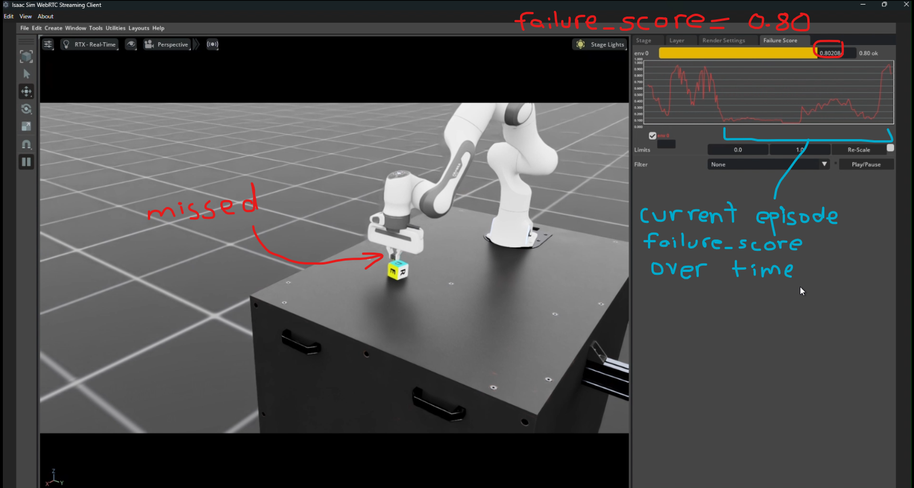
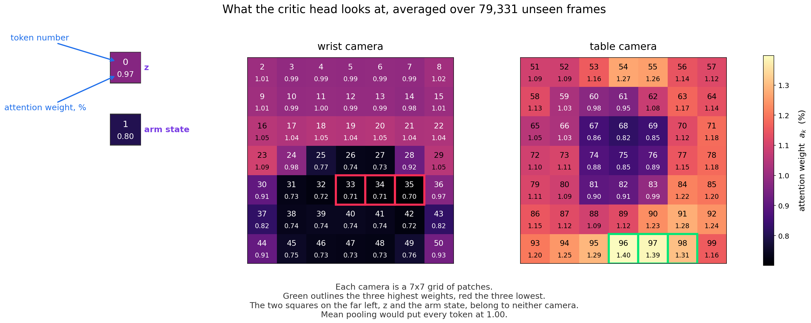

# act-critic

Over one weekend I built a proof of concept: a modified ACT architecture with a built-in critic head. Start
to finish, trained and tested in simulation.

The task is a Franka Panda arm lifting a cube to a fixed point in Isaac Sim. The policy learns it from
scripted demonstrations, and lands at a success rate that is deliberately mediocre — it has to fail often
enough to give the critic head something to detect.

Runtime failure detectors are usually a second model watching the first. This one lives inside the policy,
reading its own perception rather than inferring from the outside.

---

# TL;DR

| | |
|---|---|
| [Runtime Demo](#runtime-demo) | A picture of it running |
| [Runtime Loop](#runtime-loop) | What happens on every step at runtime |
| [Critic Head](#critic-head) | My modified ACT architecture |
| [Inside the Critic Head](#inside-the-critic-head) | The architecture I chose for the head itself |
| [ABMIL, per frame](#abmil-per-frame-attention-based-multiple-instance-learning) | The pooling method, implemented from the paper: [Ilse et al., ICML 2018](https://arxiv.org/abs/1802.04712) |
| [Datasets](docs/huggingface.md) | Every dataset and checkpoint on the Hugging Face Hub |
| [Worklog](#worklog) | Every phase of the build |
| [Stack](#stack) | Versions and hardware |
| [Run It](#run-it) | The command |

---

# Runtime Demo

The live demo, streamed out of Isaac Sim. Recorded runs are in [docs/videos/](docs/videos/).



The gripper closed just above the cube. The score climbs once the grasp misses.

---

# Runtime Loop

What happens on every step at runtime.

```
                      2 cameras 200x200 RGB  +  7 arm joints
        ┌─────────────────────────────────────────────────┐
        │                                                 v
  ┌─────┴───────────┐                       ┌─────────────────────────────────┐
  │    Isaac Sim    │                       │        ACT + critic head        │
  │  lift the cube  │                       │       ACT weights frozen        │
  │ 50 steps / sec  │                       │      one pass, two outputs      │
  └─────┬───────────┘                       └───────┬───────────────────┬─────┘
        │                                           │                   │
        │     9 joint targets                       │                   │
        └───────────────────────────────────────────┘                   │
          100-step chunk, first 10 executed                             v
                                                                  failure_score
                                                                   0.00 - 1.00
                                                                        │
                                                                        v
                                                                 ┌─────────────┐
                                                                 │ score panel │
                                                                 └──────┬──────┘
                                                                        │
   viewport + panel ──> WebRTC ──> remote viewer <──────────────────────┘
```

---

# Critic Head

My modified ACT architecture. The critic head I added branches off the transformer encoder's output.

[src/modeling/act_critic.py](src/modeling/act_critic.py)

```
  wrist ──┐
          ├──> ResNet18 ──> 98 patches ──┐
  table ──┘     (frozen)                 │
                                         │
  state ──────────────────> 1 token ─────┼──> encoder ──> scene tokens ──┬──> decoder ──> action chunk
                                         │     (frozen)     (100, 512)   │    (frozen)       (100, 9)
  z = 0 ──────────────────> 1 token ─────┘                               │                       │
                                                                      detach                     v
                                                                         │                   TCE, ACM
                                                                         │  ┌───────────────┐    │
                                                                         └─>│  critic head  │<───┘
                                                                            └───────┬───────┘
  TCE  temporal consistency error                                                   │
  ACM  action chunk magnitude                                                       v
                                                                              failure_score
                                                                                0 = fine
                                                                               1 = failing
```

---

# Inside the Critic Head

Inside that box. 100 scene tokens and two scalars in, one score out.

Trained by [src/scripts/train_critic.py](src/scripts/train_critic.py)

Scored by [src/scripts/measure_critic.py](src/scripts/measure_critic.py)

```
                          ┌─ critic head ───────────────────────────┐
  4 frames x 100 tokens   │                                         │
  (512) ─────────────────>┼- - - - -> nn.Linear 512 -> 128 *        │
                          │                    │                    │
                          │               dropout 0.1               │
                          │                    │                    │
                          │         ┌──────────┬─────────┐          │
                          │         │ ABMIL x 4 frames * │          │
                          │         └──────────┴─────────┘          │
                          │                    │                    │
                          │       4 frames x 128 concatenated       │
                          │                    │                    │
  TCE + ACM ─────────────>┼- - - - ->  + TCE + ACM = 514            │
                          │                    │                    │
                          │          nn.Linear 514 -> 1 *           │
                          │                    │                    │
                          │                 sigmoid                 │
                          └────────────────────┬────────────────────┘
                                               v
                                         failure_score

  * trained in PyTorch.

  sigmoid(x) = 1 / (1 + e^-x)
```

The tokens go through the whole stack; TCE and ACM skip it and join just before the score.

---

# ABMIL, per frame (attention-based multiple instance learning)

Gated attention pooling from [Ilse et al., ICML 2018](https://arxiv.org/abs/1802.04712). Ours matches it step for step.

Pooling blends 100 tokens into 1.

| | how each token is weighted |
|---|---|
| mean pooling | 1/100, fixed |
| max pooling | strongest wins, rest discarded |
| attention pooling | learned |

ABMIL is attention pooling, with a gate.

```
                                           1 of 4 frames, 100 tokens x 128
                                                          │
                                                          │
                                                          v
      ┌─ ABMIL, per frame ────────────────────────────────┬───────────────────────────────────────────────────┐
      │                                                   │                                                   │
      │                            PAPER                  │                  OURS                             │
      │                                                   h                                                   │
      │                                                   │                                                   │
      │                                        ┌──────────┴────────────┐                                      │
      │                                        │ 100 tokens x 128  ∈ ℝ │                                      │
      │                                        └──────────┬────────────┘                                      │
      │   ┌───────────────────────────────────────────────┤                                                   │
      │   │                                               v                                                   │
      │   │                  * tanh(V h)          * SCORE THE TOKEN          * torch.tanh(nn.Linear(t))       │
      │   │                       ⊙                       ⊙                                ⊙                │
      │   │                  * sigm(U h)              * GATE IT              * torch.sigmoid(nn.Linear(t))    │
      │   │                                               │                                                   │
      │   │                                 ┌─────────────┴───────────────┐                                   │
      │   │                                 │ 100 tokens x 128  ∈ [-1, 1] │                                   │
      │   │                                 │              ⊙              │                                   │
      │   │                                 │ 100 tokens x 128  ∈ [0, 1]  │                                   │
      │   │                                 └─────────────┬───────────────┘                                   │
      │   │                                               v                                                   │
      │   │                                 ┌─────────────┴───────────────┐                                   │
      │   │                                 │ 100 tokens x 128  ∈ [-1, 1] │                                   │
      │   │                                 └─────────────┬───────────────┘                                   │
      │   │                                               │                                                   │
      │   │                                               v                                                   │
      │   │                     * w^T(.)           * TO ONE NUMBER           * nn.Linear(gated)               │
      │   │                                               │                                                   │
      │   │                                     ┌─────────┴───────────┐                                       │
      │   │                                     │ 100 tokens x 1  ∈ ℝ │                                       │
      │   │                                     └─────────┬───────────┘                                       │
      │   │                                               │                                                   │
      │   │                                               v                                                   │
      │   │                      softmax              NORMALIZE              torch.softmax(dim=-1)            │
      │   │                                               │                                                   │
      │   │                           ┌───────────────────┴────────────────────┐                              │
      │   │                           │ 100 tokens x 1  ∈ [0, 1], summing to 1 │                              │
      │   │                           └───────────────────┬────────────────────┘                              │
      │   └────────────────────── h ──────────────────────┤                                                   │
      │                                                   v                                                   │
      │                      z = Σ aₖ hₖ                BLEND                torch.einsum("bn,bnd->bd")       │
      │                                                   │                                                   │
      │                                         ┌─────────┴──────────┐                                        │
      │                                         │ 1 token x 128  ∈ ℝ │                                        │
      │                                         └─────────┬──────────┘                                        │
      │                                                   │                                                   │
      └───────────────────────────────────────────────────┬───────────────────────────────────────────────────┘
                                                          │
                                                          v
                                                    pooled (128)

    * trained in PyTorch

      sigmoid(x) = 1 / (1 + e^-x)

      softmax(s)ᵢ = e^sᵢ / Σ e^sⱼ
```

## The learned weights

`aₖ`, the NORMALIZE output, averaged over 79,331 frames of unseen rollouts.

| k (token) | aₖ (weight) | |
|---|---|---|
| $\textcolor{#00b050}{96}$ | 1.398% | table camera, bottom row, 4th of 7 — highest |
| $\textcolor{#00b050}{97}$ | 1.390% | table camera, bottom row, 5th of 7 |
| $\textcolor{#00b050}{98}$ | 1.306% | table camera, bottom row, 6th of 7 |
| ... | ... | |
| 0 | 0.969% | z, the latent — 65th of 100 |
| ... | ... | |
| 1 | 0.801% | arm state — 82nd of 100 |
| ... | ... | |
| $\textcolor{#e01e37}{33}$ | 0.714% | wrist camera, 5th row, 4th of 7 |
| $\textcolor{#e01e37}{34}$ | 0.710% | wrist camera, 5th row, 5th of 7 |
| $\textcolor{#e01e37}{35}$ | 0.701% | wrist camera, 5th row, 6th of 7 — lowest |

An even split is 1.00%. The top ten hold 12.9% where an average gives 10%.

## Every token



---

# Worklog

The full build, phase by phase: [docs/worklog.md](docs/worklog.md).

---

# Stack

Versions and hardware: [docs/stack.md](docs/stack.md).

---

# Run It

```bash
LIVESTREAM=1 PUBLIC_IP=<lan-ip> PYTHONEXE=$PWD/.venv-lerobot/bin/python ~/isaacsim/python.sh src/scripts/eval_critic.py --model 20k --enable_cameras
```

Streams to a WebRTC client. `--model` picks the policy to run the head against. The
critic head downloads itself from [the Hub](https://huggingface.co/bjahoor/act-critic-head).
